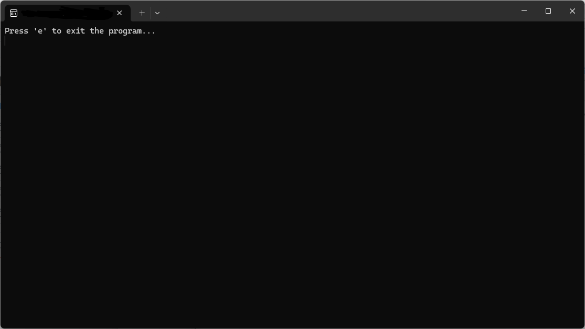

# DisableAltF4

Disables Alt + F4 temporarily. **NO need to "Run as Administrator"!** :D

Achieved by coding in low level C++. Disables Alt+F4 shortcut key temporarily **when the program is RUNNING**. If you exit the program, it would **no longer be disabled**.

## Documentation
-   `LowLevelKeyboardProc(int nCode, WPARAM wParam, LPARAM lParam)`: This is a callback function that is called by the system for each keystroke. For example, if the keystroke is Alt + F4, it returns 1 to prevent it closing apps.
    
-   `HookThread()`: This function hooks the low-level keyboard hook and runs in a loop to keep the program running.

-   `disableAltF4()`: Disables Alt F4 **temporarily**
- `main()`: Executes `disableAltF4` and contains while loop to remain the program open.

## Using the program
Execute `DisableAltF4.exe`, and press `e` to exit the program. While the program is running, `Alt + F4` key is disabled.
